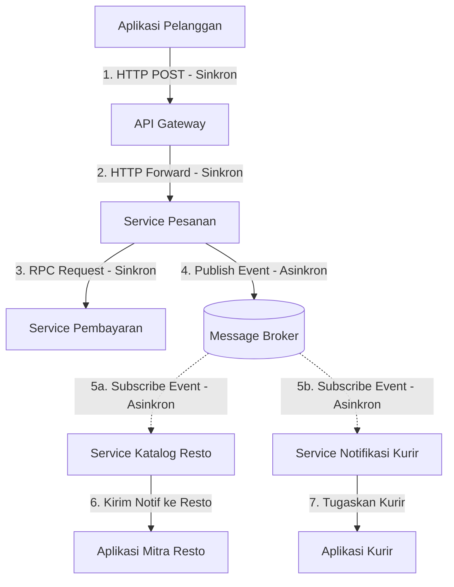
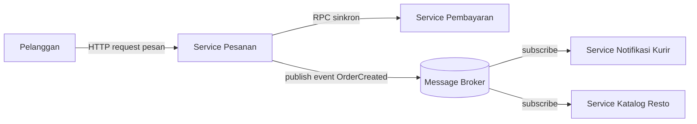

# Tugas 2 (Pekan 2) — Perancangan Arsitektur untuk FoodGo

**Materi terkait:** Architectural style (Layered, SOA, Peer-to-Peer, Publish-Subscribe).

## Studi Kasus

Melanjutkan Tugas 1: FoodGo butuh sistem yang **decoupled** agar tim kurir dan tim resto tidak saling mengganggu ketika salah satu modul diperbarui/deploy ulang. Saat ini semua modul (pesanan, pembayaran, notifikasi kurir, katalog resto) berjalan sebagai satu aplikasi monolitik — sekali deploy, semua modul ikut restart dan berisiko downtime total.

## Tugas Kelompok

1. Pilih **satu** gaya arsitektur utama: **Service-Oriented Architecture (SOA)** atau **Publish-Subscribe**. Boleh dikombinasikan (mis. SOA untuk service inti + Pub-Sub untuk notifikasi), tapi harus dijustifikasi kenapa kombinasi ini yang dipilih.
   
   **JAWAB :**

   Kami memilih Service-Oriented Architecture (SOA) sebagai arsitektur utama dan Publish-Subscribe sebagai pendukung komunikasi antar-service. Pemilihan ini disesuaikan dengan permasalahan pada sistem FoodGo yang sebelumnya masih menggunakan arsitektur monolitik, sehingga setiap modul masih saling bergantung dan ketika dilakukan perubahan atau deployment pada satu bagian, modul lainnya juga dapat ikut terdampak.Dengan menggunakan SOA, modul utama pada FoodGo seperti Pesanan, Pembayaran, Kurir/Notifikasi, dan Katalog Resto dapat dipisahkan menjadi beberapa service. Setiap service memiliki tugas masing-masing sehingga pengembangan atau perubahan pada satu service tidak harus mengubah seluruh sistem.
Selain itu, kami menggunakan konsep Publish-Subscribe untuk menangani komunikasi yang bersifat asinkron, terutama pada proses pengiriman event dan notifikasi. Contohnya ketika pesanan berhasil dibuat, Service Pesanan dapat mengirimkan event melalui Message Broker. Service Kurir/Notifikasi yang membutuhkan informasi tersebut dapat menerima event tanpa harus berkomunikasi secara langsung dengan Service Pesanan.
Dengan menggunakan SOA, modul utama pada FoodGo seperti Pesanan, Pembayaran, Kurir/Notifikasi, dan Katalog Resto dapat dipisahkan menjadi beberapa service. Setiap service memiliki tugas masing-masing sehingga pengembangan atau perubahan pada satu service tidak harus mengubah seluruh sistem.

3. Gambarkan minimal 4 komponen berikut dan interaksinya: modul Pesanan, modul Pembayaran, modul Kurir/Notifikasi, modul Katalog Resto (dan message broker/API gateway jika relevan).

3. Jelaskan alur satu skenario penuh secara end-to-end di diagram (misalnya: pelanggan buat pesanan → bayar → resto terima notifikasi → kurir ditugaskan) — tunjukkan komponen mana berkomunikasi dengan siapa, dan **jenis komunikasinya** (sinkron/asinkron, request-response/event).
   
   **JAWAB :**
Berikut adalah alur komunikasi ketika pelanggan membuat pesanan hingga pesanan diterima oleh restoran dan kurir:

Membuat Pesanan : Pelanggan menekan tombol "Pesan", aplikasi mengirimkan request ke API Gateway yang diteruskan ke Service Pesanan.
Validasi Pembayaran : Service Pesanan melakukan komunikasi sinkron (request-response) dengan Service Pembayaran untuk memotong saldo e-wallet pelanggan. Service Pesanan akan "menunggu"  hingga Service Pembayaran membalas sukses/gagal.
Publish Event : Setelah pembayaran sukses, Service Pesanan tidak memanggil Service Resto/Kurir secara langsung. Sebaliknya, ia mengirim (publish) pesan "OrderPaid" (Pesanan Dibayar) ke Message Broker , lalu langsung merespons "Pesanan Berhasil" ke layar HP pelanggan.
Subscribe Event : Service Katalog Resto dan Service Notifikasi Kurir yang terhubung ke Message Broker akan mendeteksi event "OrderPaid" tersebut.
Eksekusi Paralel: Service Resto langsung meneruskan pesanan ke layar dapur mitra resto, sementara di saat yang bersamaan Service Kurir mengeksekusi algoritma pencarian kurir terdekat. Keduanya berjalan paralel tanpa mengganggu jalannya Service Pesanan.

4. Analisis tertulis: kenapa gaya ini mengatasi masalah *coupling* dari Tugas 1, dan apa trade-off-nya (mis. Pub-Sub menambah kompleksitas debugging karena alur tidak linear).


## Cara Membuat Diagram (Gratis, Cukup Laptop)

Tidak perlu software berbayar. Dua opsi:

**Opsi A — Mermaid di dalam Markdown (disarankan).** Ditulis sebagai teks biasa di `README.md`, otomatis dirender jadi diagram oleh GitHub — tidak perlu install apa pun.

````markdown

````

**Opsi B — draw.io / diagrams.net** (gratis, jalan di browser tanpa akun, atau app desktop offline di [app.diagrams.net](https://app.diagrams.net/)). Ekspor sebagai `.png` dan simpan di folder `diagram/`.

## Struktur Submission

```
tugas-02-perancangan-arsitektur/
├── README.md          # Analisis + diagram Mermaid (jika Opsi A) atau referensi ke diagram/
├── JURNAL.md
└── diagram/            # File .png/.drawio jika pakai Opsi B
```

## Rubrik Penilaian (Tugas 2)

| Komponen | Bobot | Kriteria |
|---|---|---|
| Ketepatan pemilihan gaya arsitektur | 20% | Justifikasi SOA/Pub-Sub sesuai kebutuhan *decoupling* di skenario |
| Kelengkapan & kejelasan diagram | 30% | Semua komponen kunci ada, jenis komunikasi (sinkron/asinkron) jelas ditandai |
| Analisis trade-off | 30% | Bukan hanya kelebihan — kekurangan/kompleksitas baru juga dibahas |
| Proses & kontribusi kelompok | 20% | `JURNAL.md`, commit history |

## Batasan Penggunaan AI (Level 2)

Kebijakan **Level 2 (AI Assisted Idea Generation & Structuring)** berlaku — lihat [`../RUBRIK-UMUM.md`](../RUBRIK-UMUM.md). Boleh memakai AI untuk brainstorming komponen apa saja yang umum ada di gaya arsitektur SOA/Pub-Sub; **tidak boleh** meminta AI menggambar diagram final atau menuliskan analisis trade-off yang tinggal ditempel. Catat pemakaian AI di "Log Penggunaan AI" pada `JURNAL.md`.

- Diagram Mermaid/draw.io yang "terlalu generik" (identik dengan contoh tutorial di internet tanpa penyesuaian ke kasus FoodGo) akan dinilai rendah pada komponen kelengkapan & kejelasan diagram.
